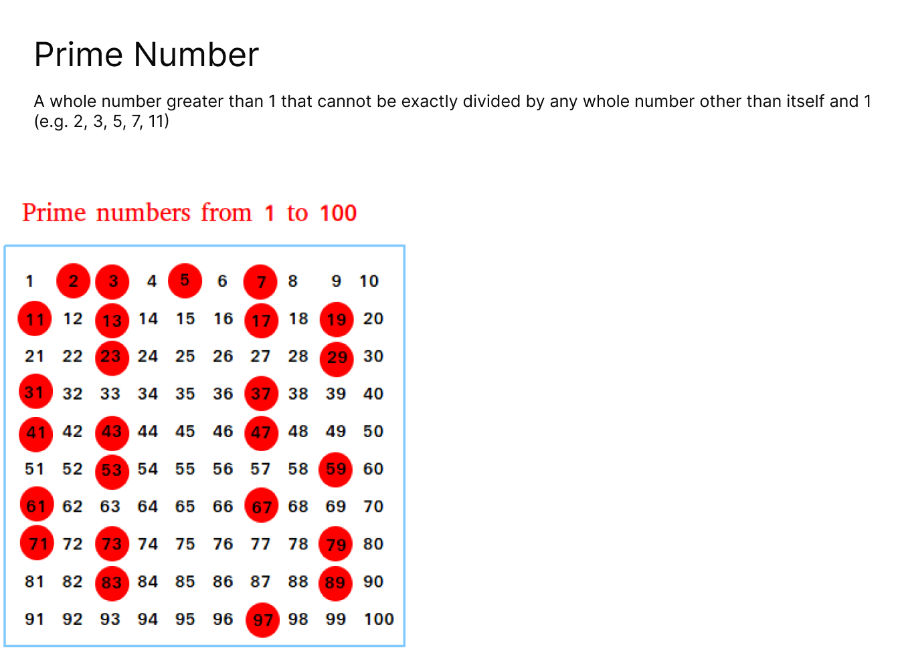

# Go Program find the prime number
A whole number greater than 1 that cannot be exactly divided by any whole number other than itself and 1 
(e.g. 2, 3, 5, 7, 11)



## Usage
```command
git clone https://github.com/jmrashed/Go-program-for-find-prime-number.git
```

## Run the program
```command
go run main.go
```


